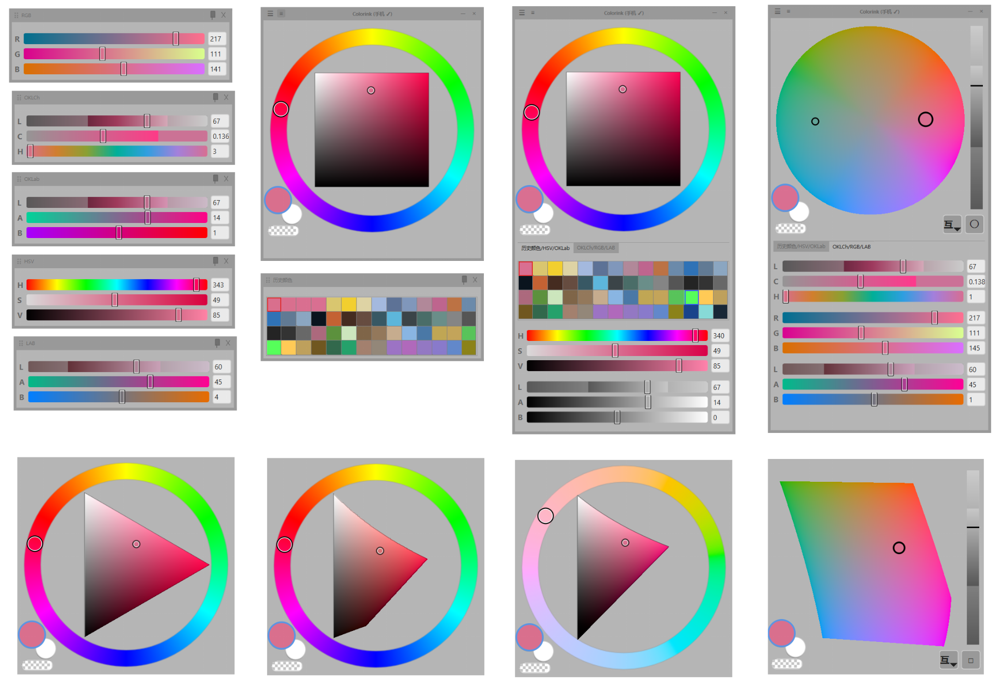

# Colorink

基于 PyQt6 的 Windows 桌面取色器 / 调色工具，为绘画与设计工作流设计：全局取色、多色空间精确调色、绘画软件颜色同步，以及系统级灰度滤镜。

当前版本：**v1.8.5**

## 交流群

遇到问题、想要反馈建议，或想跟其他用户交流使用心得？欢迎扫码加入 QQ 交流群：

<p align="center">
    
</p>

群号：**1108560464**

## 下载

最新版下载页：**https://github.com/yuebai777/colorink/releases/latest**

下载 `Colorink.exe`（onefile 单文件版），双击即可运行，无需安装、无需解压；另提供 `Colorink-Onedir.zip` 便携目录版。

> 如果 Windows 提示“Windows 已保护你的电脑”，点击“更多信息”→“仍要运行”。

### 环境要求

- Windows 10 或更高版本（64 位）
- 不需要安装 Python，也不需要安装其它依赖（发布版已内置）

## 功能特性

- **全局取色与极速画笔同步** — 
  - 任意位置按 `Ctrl+Alt+Q` 打开全屏取色放大镜，先截图再取色，预览中不会截入窗口自身；高分屏 / 多显示器 / 不同 DPR 自动适配
  - **精细像素采样**：精确采样鼠标点击位置的原始像素（保留完整原始色彩数据），不再仅取中心像素
  - **瞬时落笔**：取色后立即唤醒同步线程并 flush 写入绘画软件，彻底消除取色后画在画布上第一笔颜色不一致的问题；Companion 模式采用非阻塞 drain，延迟降至约 5.5ms~7.5ms
- **模块化面板系统（可拖拽 / 页签叠放 / 独立浮出）** —
  - **自由拖拽与重排**：开启面板抓手后，滑块组与取色历史均可自由拖拽重排位置，支持同页合并重排与空白区追加
  - **分页签叠放（Tabs）**：滑块组支持分页签展示，拖拽悬停标签头自动切换；切换色彩模式或修改设置时智能记住并恢复当前停留的前台标签页（防跳页）
  - **独立浮动窗口（Floating Panels）**：面板可直接拖出为主窗口外部的独立置顶无边框工具窗；支持 8 向边缘拉伸自由调整大小、置顶图钉切换；双击抓手快速浮出、双击浮窗标题栏或点击收回按钮自动复位到原槽位，重启自动还原
  - **智能布局与间距联动**：单面板页签内容顶部对齐；支持「顶部以及底部距离」微调并与底部边距自动联动，设置中提供一键「复位面板布局」
- **LAB 环形色盘与和谐配色（Circulant LAB Disc & Harmony）** —
  - **双视图自由切换**：鼠标悬停色轮 / LAB 区域时按 `Space` 快速切换，或任意位置按 `Ctrl+Alt+L`；色轮与 LAB 之间可显示浮动切换按钮，支持在圆形色盘（Disc）与方形色块（Square）之间自由切换
  - **环状 LAB 色盘**：平滑绘制色域边界，纯几何圆形遮罩杜绝边缘凹凸与缺口，与色相环同心同径；后台 QRunnable 多线程预计算与 LUT 查表加速，拖动与缩放全程全精度丝滑渲染
  - **五种调和配色模式**：互补（Complementary）、补色分割（Split-Complementary）、类似色（Analogous）、三色调和（Triadic）、矩形（Rectangle，90° 正方形方阵，Procreate 风格）；基准色与调和点直观标注在色盘上，直接点击即可选色
  - **智能锚点反解与防抖**：点击副点原位晋升为主点（不改变整体排布），拖动副点通过逆变换反解锚点实现整组骨架联动；5px 点击防抖容差，数位板笔点按不误触飘移
- **有效色域动态跟随与双向完全同步** —
  - 色域内微调明度时色度恒定，有效色域范围零抖动
  - 移出有效范围时自动沿最近边界映射并动态扩展有效色域，手柄始终包络在有效区间内
  - 底部滑条（OKLab / LAB / OKLCh）与右侧纵向滑条算法与数据打通，双向完全实时同步
  - 色域边界吸附：在色盘或色轮上拖拽越界时，自动吸附在离光标最近的有效色域边界点，避免粘在角落
- **统一色彩模型与 Float RGB 高精度色彩桥梁** —
  - **Float RGB 数学桥梁**：中转色彩桥梁由 8-bit 整数升级为未截断的高精度浮点 RGB（误差低至约 1.05e-9，精度提升超百万倍），彻底消除因离散截断导致的反算噪点
  - **统一色彩模型**：sRGB / HSV / HSL / CIELAB / OKLab / OKLCh 六种色空间的取色值收敛为单一不可变快照，源坐标精确往返，消除 RGB 往返导致的色相漂移；无彩色时按 HSV 与 OKLCh 分别记忆色相并在恢复时回填
  - **Qt 类型安全隔离**：数学层采用高精度浮点计算，委托给 PyQt6 控件绘图前显式安全取整，杜绝底层 TypeError
- **色空间模块与多色域滑块** —
  - HSV / VHSV / HLS / RGB / LCH 色空间模块一键切换对应色轮与滑块组合
  - RGB、HSV、HSL、CIELAB、OKLab、OKLCh 全部可调节；OKLCh 使用真实色度坐标（0~0.321），滑块轨道标出超出 sRGB 边界的部分
- **前景 / 背景双色槽与透明色** — 一键交换、复制、对比；独立**透明色**标记按钮（棋盘格胶囊），透明色可透传同步至 CSP 等支持透明色的绘画软件
- **取色历史** — 持久化色板，行列与色块大小可调；外部软件同步的颜色也会录入，支持历史色格去重与最近使用置顶
- **灰度滤镜** — 双后端：
  - **Native（默认）**：DXGI 桌面复制 + OpenGL 覆盖层，支持 OKLCh 感知灰度与 BT.709 Luma，可指定只作用于某台显示器，启动时后台预热，切换接近即时
  - **Mag**：Windows 放大镜 API 系统级 Luma（BT.709），零捕获、零覆盖窗口，与系统颜色滤镜同路径，不占额外 GPU 资源
  - 无法运行时不再静默切换，而是明确提示原因，可在设置中手动更换
- **绘画软件同步** —
  - **CSP Companion（推荐）**：CLIP STUDIO PAINT「连接智能手机」TCP 协议，二维码自动扫描（失败可手动粘贴 URL），无需内存扫描，连接稳定、极速落笔（非阻塞 drain），支持前景 / 背景与透明同步
  - **Photoshop 统一 CEP 桥**：单一用户级 CEP 扩展（`%APPDATA%\Adobe\CEP\extensions`）服务所有 Photoshop 版本（正版 / 绿色版 / 便携版），无需管理员权限；多实例按 PID 路由，低引擎占用（不卡顿 TourBox / Coolorus 等插件），独立读写前景 / 背景双色槽，设置页提供一键清理与移除扩展
  - **SAI2 / UDM**：笔刷颜色内存同步；SAI 界面画笔色块支持重绘刷新（repaint / full / off）
  - **CSP 内存同步**：针对 CSP 4.x / 5.0，支持主副色槽对称定位与自愈恢复（检测到 CSP 5.1 时请改用 Companion 手机模式）
- **数位板笔优化与全局热键** —
  - 数位板笔悬停时强制同步系统光标（十字 / 手型 / 缩放箭头 / 拖拽隐藏），与鼠标行为完全一致，完美适配 Windows Ink 与 Wintab 驱动
  - 默认快捷键采用 `Ctrl+Alt` 组合，大幅降低与绘画软件冲突概率；所有快捷键均可绑定键盘、鼠标侧键 / 中键甚至数位板笔按键；全局鼠标热键不拦截点击，绘画软件仍能收到
- **外观定制与无边框悬浮** —
  - **无边框置顶窗口**：极简悬浮，不用时贴边隐藏；`Ctrl+Alt+K` 快速切换标题栏显隐
  - **背景 / 边框透明度**：设置 → 界面 → 「背景不透明度」0%~100% 无级调节，窗口底色、外框与标题栏一起变透，直接看见下面的画布；0% 即完全隐形，只剩滑块与色环浮在画布上，拖动实时预览，松手写入配置；滑块、色轮、色块与数值框始终不透明，取色纯净不掺底色
  - **边框主题与滑块风格**：支持边框主题（窗口外框、分组框、数值框）与多种滑块样式自由搭配
  - **Ringless 极简切片模式**：可隐藏色环、放大颜色切片，切片框自动贴合窗口宽度
- **易用性与稳健性** —
  - **免管理员开机自启动**：采用当前用户注册表模式（HKCU Run），无需管理员授权，无 UAC 弹窗打扰
  - **全控件悬停提示（Tooltips）**：集中维护 46+ 项控件悬停说明，支持中英文双语即时切换
  - **界面语言**：设置中可在「自动 / 中文 / English」间切换
  - **更新检查与原子自替换**：从 GitHub Releases 拉取更新，自动识别 onedir / onefile 资产，下载先落 `.part` 临时文件并校验 SHA-256，支持原子替换自重启与跳过指定版本
  - **稳健可靠**：DPI 动态自适应、单实例锁、原子配置写入、崩溃报告（`stderr.log` 定位）；设置页可一键「复制诊断信息」（版本 / 同步状态 / 最近日志）便于反馈问题

## 截图



## 从源码运行（给开发者 / 想改代码的人）

需要先安装 Python 3.10+。

```bash
git clone https://github.com/yuebai777/colorink.git
cd colorink
pip install -r requirements.txt
python main.py
```

或双击 `run.bat`（以 `pythonw` 无控制台窗口启动）。

## 快捷键（可在设置中修改）

| 功能 | 默认 |
|------|------|
| 取前景色 | `Ctrl + Alt + Q` |
| 切换跟随鼠标 | `Ctrl + Alt + J` |
| 显示 / 隐藏窗口 | `Ctrl + Alt + Y` |
| 显示 / 隐藏标题栏 | `Ctrl + Alt + K` |
| 切换灰度滤镜 | `Ctrl + Alt + D` |
| 切换 LAB 视图（鼠标悬停色轮 / LAB 区域） | `Space`（也可设为鼠标侧键 / 中键） |
| 切换 LAB 视图（全局） | `Ctrl + Alt + L` |

> **提示**：
> - 所有快捷键均可绑定鼠标按键（侧键 / 中键等）或数位板笔按键。全局快捷键绑定鼠标按键时，点击不会被拦截，画画软件仍会收到该点击。
> - **调和配色交互**：色盘上的调和指示点可直接点击选色；拖动副点时整组骨架联动；内置 5px 点击防抖容差，数位板笔点按不会误触拖动。
> - **面板拖拽与浮动**：开启面板抓手后，双击抓手可快速浮出为独立窗口；双击浮窗标题栏或点击收回按钮即可复位回原槽位。

## 灰度滤镜说明

- **Native（默认）**：OKLCh 感知灰度更符合人眼明度感知；Luma 模式为标准 BT.709 权重。可指定只对某一台显示器生效。依赖 dxcam + OpenGL，GPU 需支持 OpenGL 3.3+
- **Mag**：系统级灰度，全屏生效，仅提供 Luma 模式，兼容性最好（不支持 OpenGL 的环境可用）

所选后端无法运行时不再静默切换，而是明确提示原因，可在设置中手动更换。

## 打包（独立 EXE）

```bash
pip install pyinstaller
python build_pyqt.py
```

打包输出在 `dist/` 目录：

- `dist/Onedir/Colorink/`：目录版，便于排查运行依赖
- `dist/Onefile/Colorink.exe`：单文件版，适合作为 GitHub Release 下载资产

打包前会校验 `APP_VERSION`、Windows 文件版本与 `release_notes.md` 三者一致，版本漂移直接失败。CSP Companion 的二维码自动扫描依赖 `pyzbar`、`Pillow`、`mss`；源码安装会随 `requirements.txt` 安装，发行包已内置。二维码不可用时仍可手动粘贴连接 URL。

## 开发

- 灰度原生运行时（`native_grayscale/runtime/grayscale_overlay.pyc`）随仓库分发，`python native_grayscale/build_runtime.py` 可复现编译；原生灰度不可用时自动回退 Mag 后端
- `tests/` 含 1200+ 项自动化测试（发布契约、窗口布局不变量、首次启动默认值、高精度色彩转换、边界吸附、面板拖拽回归等），`python -m pytest` 运行
- 改动后要跑哪些测试、发版前要过哪些关，见 [TESTING.md](TESTING.md)；纯手动打勾清单见 [CHECKLIST.md](CHECKLIST.md)
- `tools/` 含同步诊断与端到端稳定性脚本（内存探针、写路径对比等），便于排查 CSP / PS 同步问题
- 架构与设计说明见 [DESIGN.md](DESIGN.md)，色彩转换管道见 [OKLCH_CONVERSION_PIPELINE.md](OKLCH_CONVERSION_PIPELINE.md)

## 支持作者

如果 Colorink 帮到了你，欢迎请我喝杯咖啡 ☕ —— 扫码即可，感谢支持！


## License

[GPL-3.0](LICENSE) —— 使用、修改或分发本项目代码时，你的衍生作品也必须以 GPL-3.0 开源（copyleft）。

## 免责声明 / Disclaimer

- 本项目（Colorink）是一个独立的开源辅助工具，遵循 GNU General Public License v3.0 (GPL-3.0) 协议开源。
- 本项目及文档中提及的 Adobe Photoshop®、CLIP STUDIO PAINT®、PaintTool SAI®、Procreate® 等软件名称与商标，其著作权、商标权及其他知识产权均归各自的权利人所有。
- 本项目仅为提升绘画与设计工作流效率而通过公开系统 API 或兼容协议实现画笔颜色同步与辅助取色，与 Adobe、CELSYS、SYSTEMAX 等商业公司不存在任何从属、投资、合作、赞助或官方背书关系。

